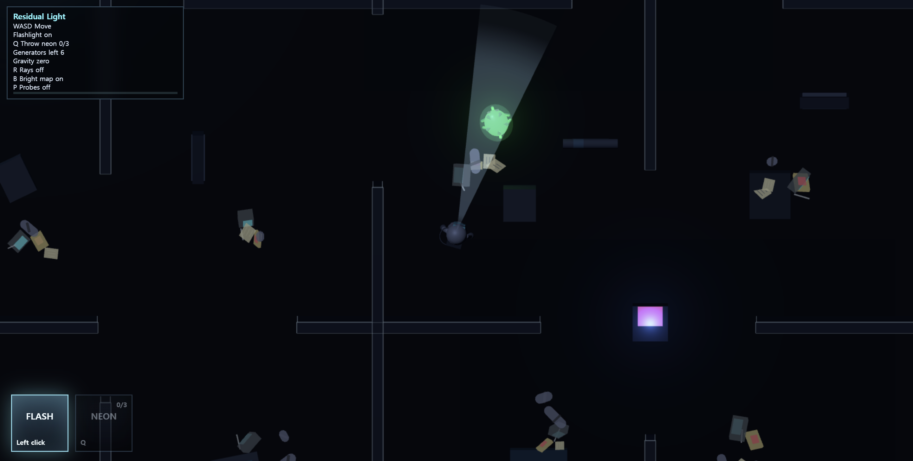
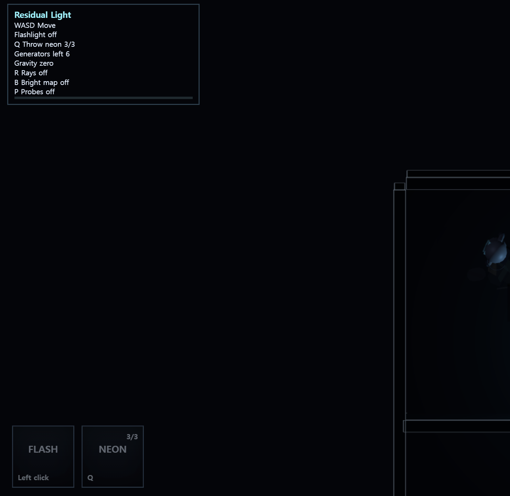
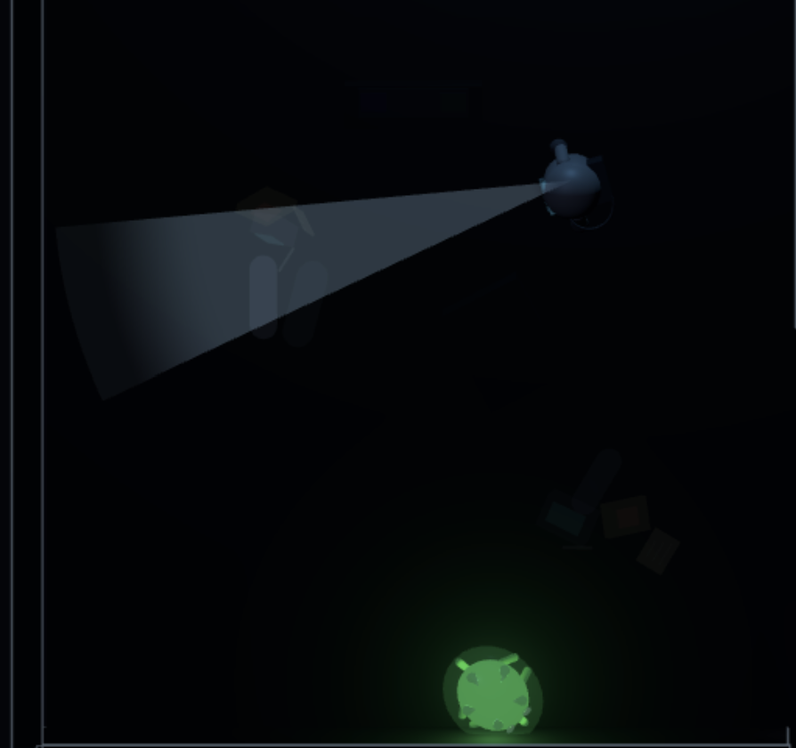

# Residual Light Final Report

> **중요: 이미지 교체 필요**  
> 본 리포트의 `report-images/*.png` 이미지는 제출 전에 반드시 실제 실행 중인 본인 게임 화면 캡처로 교체해야 한다.  
> 과제 가이드에 따라 본인 게임 캡처가 아닌 설명은 0점 처리될 수 있으므로, 아래의 `TODO: 캡처 필요` 표시가 있는 모든 이미지를 실제 플레이 화면으로 채워야 한다.

## 1. 프로젝트 개요



`Residual Light`는 Three.js 기반 웹 탑뷰 생존 게임이다. 전력이 끊긴 우주정거장에서 우주비행사 Isaac은 발전기 6개를 수리하고, 모든 발전기를 복구한 뒤 우주정거장 밖 기동대에게 전력 복구 완료를 보고해야 한다. 정거장 안에는 빛에 반응하는 외계 생명체 Lumen이 돌아다니며, Isaac은 손전등과 네온볼을 이용해 Lumen의 이동을 유도하거나 회피한다.

최종 구현된 핵심 요소는 다음과 같다.

- Three.js 기반 웹 구동 게임
- `Intravenous` 스타일 탑뷰 카메라
- WASD 이동, 마우스 방향 손전등 조준
- 좌클릭 손전등 on/off, Q 네온볼 투척
- 발전기 6개 수리 및 최종 보고 승리 조건
- Lumen 10마리의 빛 기반 추적/순찰 AI
- DDGI 기반 indirect lighting 시스템
- R direct/indirect ray debug, P probe marker debug, B 밝기 debug
- 무중력 상태와 10초 정상 중력 활성 시스템
- 우주정거장 시설, 가구, 부유 오브젝트, 우주복 Isaac, 외계생명체 Lumen 외형

## 2. 조작 및 게임 흐름



게임 시작 상태는 손전등 off, ray debug off, bright map off, probe debug off이다. 좌측 상단 HUD에는 필수 조작과 상태만 표시하고, 좌측 하단에는 손전등과 네온볼 아이템 슬롯을 표시한다.

| 입력 | 기능 |
| --- | --- |
| `WASD` | Isaac 이동 |
| Mouse | 손전등 방향 조준 |
| Left click | 손전등 on/off |
| `Q` | 네온볼 투척 |
| Hold `E` | 발전기 또는 중력 제어 장치 수리 |
| `R` | direct/indirect ray debug 표시 on/off |
| `P` | DDGI probe marker 표시 on/off |
| `B` | 맵 밝기 debug on/off |

플레이 흐름은 다음과 같다.

1. Isaac이 어두운 정거장 안에서 손전등과 네온볼로 주변을 확인한다.
2. Lumen은 직접광 또는 DDGI indirect ray에 반응해 이동한다.
3. Isaac은 발전기 6개를 찾아 `E`를 누르고 있어 수리한다.
4. 발전기를 수리할 때마다 `Generator restored N/6` 안내 문구가 화면 중앙에 fade-in/fade-out으로 표시된다.
5. 모든 발전기를 수리하면 `Go to report power restoriation!` 문구가 표시된다.
6. 최종 extraction console에서 보고하면 승리한다.

## 3. 강의 내용과 구현 내용 매핑


| 강의 주제 | 강의 개념 | 본 게임 구현 |
| --- | --- | --- |
| Transform | model/world/view transform, 좌표계, 회전/이동 | Isaac, Lumen, 부유 오브젝트, 발전기, 벽을 `THREE.Group`과 `Mesh` transform으로 배치했다. Three.js의 RHS 기준으로 `W=-Z`, `S=+Z`, `A=-X`, `D=+X` 이동을 적용했다. |
| Graphics Pipeline | scene graph, camera, projection, rendering loop | `Game` 클래스가 scene graph를 구성하고, `TopDownCamera`가 orthographic projection으로 탑뷰를 렌더링한다. |
| Rasterization / Visibility | depth, occlusion, first hit 판정 | `THREE.Raycaster`로 벽과 구조물에 의한 occlusion을 검사한다. direct ray나 indirect ray가 Lumen을 먼저 hit해야 Lumen이 빛에 반응한다. |
| Shading / Lighting | direct lighting, point light, spot light, material response | 손전등은 SpotLight, 네온볼/발전기/중력 제어 장치는 PointLight로 구현했다. 물체는 direct/indirect lighting 값에 따라 어둡거나 밝게 보인다. |
| Texture / Material | diffuse color, metalness, roughness, emissive | 우주정거장 벽, 바닥, 가구, 발전기, Lumen, Isaac에 서로 다른 material color/roughness/metalness/emissive를 적용했다. |
| Global Illumination | direct light가 표면에 닿은 뒤 indirect light로 퍼지는 현상 | DDGI probe가 ray sampling으로 surface hit를 찾고, hit point의 radiance를 L1 SH에 저장해 간접광을 근사한다. |
| DDGI | probe grid, ray tracing, SH storage, temporal feedback, interpolation | `DDGIManager`가 uniform probe grid, spherical ray sampling, L1 SH RGB, temporal feedback, trilinear interpolation을 구현한다. |
| Animation | time-based update, skeleton/rig 대신 procedural motion | Isaac 이동, Lumen 순찰/추적, Lumen 촉수 흔들림, 무중력 부유 오브젝트 motion을 delta time 기반으로 갱신한다. |

## 4. Scene Graph와 시스템 구조


게임 구조는 `Game` 클래스를 중심으로 분리했다. `Game`은 scene에 정거장 맵, 플레이어, 목표물, Lumen, DDGI, 중력 시스템, debug ray group을 추가하고 매 프레임 update 순서를 관리한다.

```ts
this.scene.add(this.stationMap.group);
this.scene.add(this.player.object);
this.scene.add(this.objectives.group);
this.scene.add(this.lumens.group);
this.scene.add(this.ddgi.group);
this.scene.add(this.gravitySystem.group);
this.scene.add(this.directLightDebugGroup);
```

이 구조는 graphics pipeline 강의의 scene graph 개념과 연결된다. 각 오브젝트는 local transform을 가지고, scene graph에 추가된 뒤 camera/view/projection 변환을 거쳐 화면에 rasterize된다.

## 5. 맵과 오브젝트 구성


맵은 약 `60 x 40` 크기의 정거장으로 확장했다. 발전기 수는 6개로 유지하고 맵 전역에 분산 배치했다. 중력 제어 장치는 맵 중앙에 배치했다.

정거장 내부에는 단순 벽과 상자만 두지 않고 우주정거장에서 쓰일 만한 시설을 추가했다.

- bunk bed
- console bank
- storage rack
- oxygen tank cluster
- work table
- medical pod
- 부유 전자기기, 식량팩, 메모지, 침낭

시설물과 벽은 `MeshStandardMaterial` 기반 light-reactive mesh로 등록되어, 빛이 없는 곳에서는 거의 보이지 않고 손전등, 네온볼, 발전기 direct light 또는 DDGI indirect light가 도달할 때 보이도록 했다.

## 6. Direct Lighting 구현



손전등은 Three.js `SpotLight`로 구현했다. 왼쪽 클릭으로 on/off 할 수 있고, 방향은 WASD 이동 방향이 아니라 마우스 조준 위치만 따라간다. 화면에는 탑뷰에서 잘 보이도록 별도의 평면 fan mesh를 표시한다.

```ts
this.flashlight = new THREE.SpotLight(
  0xdcecff,
  4.5,
  FLASHLIGHT_RANGE,
  FLASHLIGHT_LIGHT_HALF_ANGLE,
  0.55,
  1.4,
);
```

손전등 시각 cone은 `BufferGeometry`로 만든 fan mesh이다. 이 fan은 Isaac local origin에서 시작하므로, 멀리 비춰도 cone 시작점이 Isaac에게 고정된다.

```ts
positions.push(
  origin.x, origin.y, origin.z,
  p0.x, p0.y, p0.z,
  p1.x, p1.y, p1.z,
);
```

직접광 debug는 `R`키로 켜고 끌 수 있다. SpotLight debug는 단일 ray가 아니라 cone 범위를 여러 방향 ray로 샘플링한다.

```ts
const angleOffset = THREE.MathUtils.lerp(-halfAngle, halfAngle, t);
const direction = new THREE.Vector3(
  Math.cos(centerAngle + angleOffset),
  0,
  Math.sin(centerAngle + angleOffset),
);
```

이 부분은 shading/lighting 강의의 direct lighting 개념과 연결된다. 손전등은 광원에서 표면 또는 Lumen까지 직접 도달하는 빛이며, 벽에 막히면 도달하지 않는다.

## 7. DDGI 구현 개요


본 프로젝트에서 선택한 GI 기술은 DDGI이다. DDGI는 공간에 probe를 배치하고, 각 probe가 여러 방향으로 ray를 쏘아 주변 표면에서 들어오는 radiance를 저장한 뒤, 임의 위치에서는 주변 probe 값을 보간해 indirect lighting을 얻는 방식이다.

최종 DDGI 설정은 다음과 같다.

```ts
const GRID_X = 18;
const GRID_Y = 2;
const GRID_Z = 12;
const PROBE_SPACING = 3.5;
const RAYS_PER_PROBE = 18;
const PROBES_PER_FRAME = 8;
```

전체 probe 수는 `18 * 2 * 12 = 432`개이다. 모든 probe를 매 프레임 갱신하면 웹 게임에서 버벅임이 커지므로, frame당 8개씩 round-robin 방식으로 갱신한다. 이는 DDGI 강의에서 다루는 probe update 비용과 실시간성 trade-off와 연결된다.

## 8. Probe Ray Sampling과 Radiance Capture


각 probe는 spherical Fibonacci 방향 분포를 사용해 여러 방향으로 ray를 발사한다. ray가 벽, 가구, 발전기 같은 surface에 닿으면 hit point와 normal을 얻고, 그 표면에서 light sample이 보이는지 다시 검사한다.

```ts
for (const direction of this.rayDirections) {
  this.raycaster.set(probe.position, direction);
  this.raycaster.far = 18;

  const hit = this.raycaster.intersectObjects(raycastTargets, true)[0];
  if (!hit) continue;

  const radiance = this.computeRadiance(
    hit.point,
    hitNormal,
    lightSamples,
    raycastTargets,
  );
}
```

`computeRadiance()`에서는 surface에서 light까지의 visibility를 검사한다.

```ts
if (!this.canReachLight(point, toLight, distance, raycastTargets)) continue;
```

따라서 손전등 빛이 벽을 통과해서 probe에 누적되지 않는다. 이 부분은 rasterization/visibility 강의의 first hit, depth, occlusion 개념과 직접 연결된다.

## 9. L1 Spherical Harmonics 저장과 보간


DDGI probe는 들어온 radiance를 L1 Spherical Harmonics RGB 계수 4개에 저장한다.

```ts
const basis = [
  SH_C0,
  SH_C1 * direction.y,
  SH_C1 * direction.z,
  SH_C1 * direction.x,
];

for (let i = 0; i < 4; i += 1) {
  sh[i].addScaledVector(radiance, basis[i]);
}
```

임의 위치의 indirect lighting은 주변 8개 probe를 trilinear interpolation으로 보간해 얻는다.

```ts
const weight = wx * wy * wz;
result.addScaledVector(
  this.evaluateSH(this.probeAt(x, y, z).sh, normal),
  weight,
);
```

이 구현은 DDGI 강의의 probe-based GI, SH storage, 8-probe interpolation과 연결된다. L1 SH만 사용하므로 매우 날카로운 간접 그림자는 표현하기 어렵지만, 게임플레이용 간접광 방향과 강도는 빠르게 근사할 수 있다.

## 10. Temporal Feedback


각 probe는 현재 frame의 direct radiance만 저장하지 않고, 이전 probe SH 값을 feedback으로 더한다.

```ts
const feedback = this.sampleNearestPrevious(hit.point, hitNormal)
  .multiplyScalar(FEEDBACK_STRENGTH);
radiance.add(feedback);
```

이는 DDGI 강의에서 recursive/temporal feedback으로 indirect bounce를 근사하는 부분과 연결된다. 실제 path tracing처럼 많은 bounce를 계산하지는 않지만, 이전 frame의 irradiance를 일부 반영하여 빛이 공간에 남아 퍼지는 듯한 효과를 만든다.

## 11. Probe Grid와 부유 오브젝트 분리


처음에는 probe 위치에 물체 geometry를 직접 표시할 수 있었지만, uniform grid가 플레이어 눈에는 부자연스럽게 보였다. 최종 구조에서는 계산용 DDGI probe와 실제 게임에서 보이는 부유 물체를 분리했다.

| 항목 | 역할 |
| --- | --- |
| 계산용 probe grid | DDGI irradiance 계산, P키 marker debug |
| 부유 오브젝트 | 플레이어가 보는 전자기기/식량팩/메모지/침낭 geometry |
| linked probe | 부유 오브젝트가 가장 가까운 DDGI probe의 irradiance와 dominant direction을 사용 |

```ts
type FloatingGIObject = {
  group: THREE.Group;
  position: THREE.Vector3;
  linkedProbeIndex: number;
  phase: number;
};
```

부유 오브젝트는 무중력 상태에서는 떠다니고, 중력 제어 장치 수리 후 10초 동안 정상 중력이 활성화되면 바닥에 내려와 멈춘다. 이로써 gameplay concept과 DDGI 시각화가 자연스럽게 연결된다.

## 12. Lumen AI와 빛 상호작용


Lumen은 총 10마리이며, 맵의 여러 구역에 분산 스폰된다. Lumen의 목표 선택은 다음 순서로 진행된다.

1. 직접 보이는 광원 후보를 평가한다.
2. 손전등 direct cone ray가 Lumen geometry를 first hit로 맞히면 Isaac/flashlight 방향으로 접근한다.
3. 네온볼 또는 extraction console 같은 point light가 직접 보이면 그 방향으로 접근한다.
4. 직접광 후보가 없으면 부유 오브젝트의 DDGI indirect ray가 Lumen geometry에 닿는지 검사한다.
5. direct/indirect ray가 모두 없으면 `roamRoute`를 따라 정거장 내부를 순찰한다.

손전등 direct light 인식은 SpotLight cone 전체를 여러 ray로 샘플링하고, ray가 Lumen을 먼저 맞혔는지 검사한다.

```ts
if (this.doesRayHitLumenFirst(light.position, direction, light.radius, lumen)) {
  const normalizedOffset = halfAngle > 0
    ? Math.abs(angleOffset) / halfAngle
    : 0;
  bestScore = Math.max(
    bestScore,
    THREE.MathUtils.lerp(1, 0.25, normalizedOffset),
  );
}
```

간접광 fallback은 부유 오브젝트의 irradiance ray를 사용한다.

```ts
for (const sample of floatingObjectSamples) {
  if (sample.intensity <= 0.0001) continue;

  const targetDistance = sample.position.distanceTo(this.getLumenAimPoint(lumen));
  const rayLength = Math.max(targetDistance + 0.5, 1);
  if (!this.doesRayHitLumenFirst(sample.position, sample.direction, rayLength, lumen)) {
    continue;
  }
}
```

이 구조는 "Lumen은 빛, 특히 indirect lighting에 반응한다"는 게임 컨셉을 DDGI 시스템과 직접 연결한다.

## 13. 어두운 공간에서의 Visibility


정거장은 기본적으로 매우 어둡다. 큰 바닥/구역 mesh는 통째로 밝아지는 직사각형 artifact를 피하기 위해 light-reactive 대상에서 제외했고, 벽, 시설물, 발전기, 부유 오브젝트는 direct/indirect lighting에 따라 보인다.

```ts
const reveal = Math.max(
  brightnessDebug ? 0.78 : 0,
  THREE.MathUtils.clamp(
    indirect.length() * 0.5 + direct.length() * 0.08,
    0,
    1,
  ) * observerVisibility,
);
```

이 구현은 shading 강의의 material response와 rasterization 강의의 visibility 개념을 결합한다. 빛이 닿지 않거나 Isaac 기준으로 구조물에 가려진 물체는 어둡게 남고, 빛이 도달한 물체만 색이 올라온다.

## 14. 무중력과 Dynamic GI


게임은 기본적으로 무중력 상태이다. 중력 제어 장치를 수리하면 10초 동안만 정상 중력이 활성화되고, 이후 다시 무중력 상태로 돌아간다.

```ts
const NORMAL_GRAVITY_SECONDS = 10;
private lowGravity = true;
```

```ts
private activateGravityWindow() {
  this.lowGravity = false;
  this.normalGravityRemaining = NORMAL_GRAVITY_SECONDS;
}
```

무중력 상태에서는 Isaac 이동에 관성을 적용해 미끄러지는 느낌을 준다. 현재 무중력 이동속도는 플레이 편의를 위해 `PLAYER_SPEED * 1.24`로 조정했다.

```ts
if (lowGravity) {
  const targetVelocity = movement
    .clone()
    .multiplyScalar(PLAYER_SPEED * 1.24);
  this.velocity.lerp(targetVelocity, 0.072);
  this.velocity.multiplyScalar(Math.pow(0.94, deltaSeconds * 60));
}
```

부유 오브젝트도 무중력 상태에서는 떠다니다가, 정상 중력이 켜진 10초 동안 바닥으로 내려와 정지한다. 이 변화는 DDGI raycast target과 visibility에도 영향을 준다.

## 15. 캐릭터와 외형 구현


Isaac은 단순 capsule에서 끝내지 않고, helmet, visor, backpack, chest panel, arm/glove, leg/boot, oxygen hose를 추가해 우주비행사처럼 보이게 했다. Lumen은 발광 core, 반투명 membrane, 눈, crest spike, tendril, under-glow를 가진 외계생명체로 꾸몄다.

Lumen 촉수와 돌기는 시간 기반으로 흔들리며, 이는 animation 강의의 time-based procedural animation과 연결된다.

```ts
agent.tendrils.forEach((part, index) => {
  const phase = elapsedSeconds * 2.3 + index * 0.9;
  part.rotation.y = Math.sin(phase) * 0.28;
  part.scale.y = 1 + Math.sin(phase + 0.6) * 0.08;
});
```

충돌과 AI 판정은 외형 mesh가 아니라 기존 radius 기반 로직을 유지한다. 따라서 시각적 복잡도를 높이면서도 gameplay collision은 안정적으로 유지된다.

## 16. UI와 피드백


게임 시작 시 중앙에 `Repair Generators in this space station.` 문구가 서서히 나타났다가 사라진다. 발전기를 수리할 때마다 `Generator restored N/6`이 같은 방식으로 표시되고, 모든 발전기를 수리하면 `Go to report power restoriation!`이 표시된다.

아이템 슬롯은 좌측 하단에 표시된다.

- 손전등 슬롯: 좌측 하단 `Left click`, 손전등 on일 때 밝아짐
- 네온볼 슬롯: 좌측 하단 `Q`, 우측 상단 `N/3`, 투척 성공 시 짧게 밝아짐

이 UI는 게임플레이 상태를 직접적으로 보여주므로, 최종 리포트 캡처에서 조작과 상태 피드백을 설명하는 증거로 사용할 수 있다.

## 17. 성능 최적화


초반 버벅임을 줄이기 위해 기능은 유지하되 계산량을 분산했다.

- DDGI probe update: frame당 8개만 round-robin 갱신
- probe marker visual update: P키 debug on일 때만 수행
- 부유 오브젝트 visibility: frame당 36개씩 분할 갱신
- Lumen AI용 floating object samples: Lumen마다 새로 생성하지 않고 frame 단위로 재사용
- raycast target 배열: 매 프레임 새 배열을 만들지 않고 캐시
- 맵/목표물 lighting visibility: 격프레임 갱신

이는 실시간 그래픽스에서 품질과 성능 사이의 trade-off를 조절한 사례이다. DDGI 품질은 유지하되, 모든 연산을 한 프레임에 몰지 않아 웹 환경에서 더 안정적으로 구동되도록 했다.

## 18. 실행 및 검증


로컬 실행 및 빌드 검증 명령은 다음과 같다.

```bash
npm install
npm run build
```

VS Code Live Server를 사용할 때는 `/dist`가 열리도록 설정되어 있다. 제출 전에는 반드시 `npm run build`를 실행한 뒤 Live Server 또는 배포 URL에서 게임이 정상 구동되는지 확인해야 한다.

현재 개발 중 반복적으로 `npm run build`를 실행했고, TypeScript compile과 Vite production build가 성공했다. 다만 Vite의 chunk size warning은 남아 있다. 이는 빌드 실패가 아니라 번들 크기 경고이며, 현재 과제 구동에는 직접적인 문제를 만들지 않는다.

## 19. 한계와 개선점


현재 DDGI는 과제용 simplified implementation이다.

- L1 SH만 사용하므로 고주파 indirect shadow 표현은 제한적이다.
- probe update를 frame당 8개로 제한하므로 indirect lighting 반응이 약간 늦게 보일 수 있다.
- Three.js `Raycaster` 기반 근사이므로 실제 GPU ray tracing 또는 path tracing 수준의 정확도는 아니다.
- 부유 오브젝트는 nearest probe irradiance를 사용하므로, 오브젝트 자체가 완전한 GI volume은 아니다.
- direct/indirect debug ray는 이해를 돕기 위한 시각화이며, 물리적으로 완전한 광선 시뮬레이션은 아니다.

하지만 과제 요구사항 관점에서는 DDGI의 핵심 요소인 probe grid, ray sampling, SH storage, temporal feedback, interpolation, indirect-light 기반 gameplay를 모두 게임 시스템 안에 포함했다.

## 20. 제출 전 캡처 체크리스트

아래 이미지는 제출 전에 실제 게임 화면으로 채워야 한다.

| 파일 | 캡처해야 할 장면 |
| --- | --- |
| `report-images/01-overview.png` | 전체 게임 화면: Isaac, Lumen, HUD, 아이템 슬롯 |
| `report-images/02-ddgi-probes.png` | P키로 DDGI probe marker를 켠 화면 |
| `report-images/03-scene-graph.png` | 정거장 맵 구조와 주요 오브젝트 배치 |
| `report-images/04-lighting.png` | 손전등 cone/direct lighting 장면 |
| `report-images/05-ddgi-neon.png` | 네온볼 주변 indirect lighting 또는 부유 오브젝트 tint |
| `report-images/06-lumen-ai.png` | Lumen이 빛을 따라 이동하는 장면 |
| `report-images/09-gravity-ddgi.png` | 중력 제어 장치 수리 후 normal gravity 10초 상태 |
| `report-images/10-victory.png` | 발전기 6개 수리 후 최종 보고/승리 화면 |
| `report-images/11-limitations.png` | DDGI 한계 설명용 장면 |
| `report-images/12-hud-item-slots.png` | 좌측 상단 HUD와 좌측 하단 아이템 슬롯 |
| `report-images/13-station-layout.png` | B키 밝기 debug로 맵 전체 구조 확인 |
| `report-images/14-station-facilities.png` | 우주정거장 시설/가구가 보이는 장면 |
| `report-images/15-ray-debug.png` | R키 ray debug 화면 |
| `report-images/16-temporal-feedback.png` | 네온볼 투척 후 indirect lighting 변화 |
| `report-images/17-floating-objects-probes.png` | 부유 오브젝트와 probe marker 관계 |
| `report-images/18-dark-visibility.png` | 빛이 닿은 물체만 보이는 어두운 장면 |
| `report-images/19-character-visuals.png` | Isaac 우주복과 Lumen 외형 |
| `report-images/20-ui-feedback.png` | 중앙 mission prompt와 아이템 슬롯 |
| `report-images/21-performance-normal-view.png` | debug off 일반 플레이 화면 |

## 21. 결론

`Residual Light`는 강의에서 배운 transform, graphics pipeline, rasterization/visibility, shading/lighting, material, animation, DDGI 개념을 하나의 playable game으로 연결한 프로젝트이다. 특히 단순히 DDGI를 화면 효과로만 넣지 않고, Lumen AI가 direct light와 DDGI indirect ray를 기준으로 행동하도록 만들어 GI 기술이 gameplay rule에 직접 관여하게 했다.

최종적으로 플레이어는 어두운 우주정거장에서 손전등과 네온볼, 발전기 조명, DDGI 간접광, 무중력 상태 변화를 이용해 Lumen을 피하고 목표를 완수해야 한다. 이 점에서 본 프로젝트는 과제 요구사항인 기획, 완성도, GI 기술 적용, 리포트 설명 가능성을 모두 만족하도록 구성했다.
